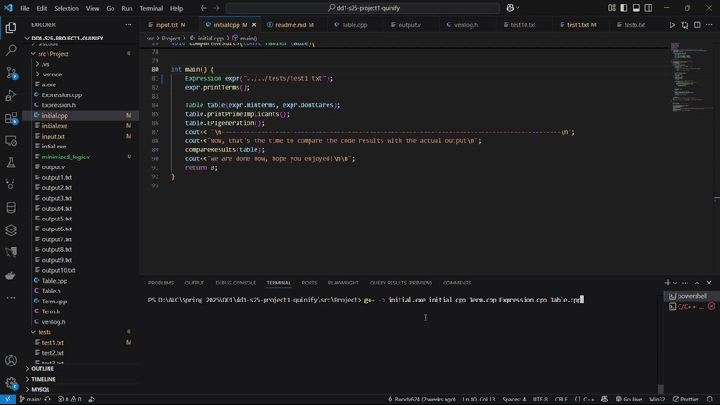

# **Quine-McCluskey Logic Minimization**

A **solver** for logic functions using the **Quine-McCluskey alogrithm**, designed to support functions up tp **20 variables**. This tool allows users to easily, and quickly solve logic functions while handling common **errors** and possible **edge cases**.

<div align="center">



</div>


## key features of the C/C++ program
- Reads an input of text file stating the boolean function in terms of minterms/maxterms and don't care terms.
- Generates the prime implicants **(PIs)**, and uses them to identify all the essential prime implicants **(EPIs)**.
- Derive **all** possible minimized forms of the boolean expression of the function using the **PI** table.
- There are 10 test cases to showcase the features of the project's implementation.

## Build & Usage Instructions

1. **Clone the project**

```bash
  git clone https://github.com/CSCE2301/dd1-s25-project1-quinify.git
```

2. **Go to the project directory**

```bash
  cd .\src\project
```
3. **Make sure you have the correct test case in the main function**


4. **Open your terminal**
5. **Compile all the cpp files**

```bash
  g++ -o initial.exe initial.cpp Term.cpp Expression.cpp Table.cpp
```

6. **Run the solver**

```bash
  .\initial.exe 
```
